# FYI Backend Architecture Guide

This guide explains how the NewsScrapper / Sense.AI backend works, from the 10,000-foot view down to the knobs someone can safely change when hosting, onboarding users, switching profiles, or tuning the AI pipeline.

It is written for a completely new person who has never seen the codebase.

## Table Of Contents

1. Executive Overview
2. System Map
3. Backend Entry Point: `main.py`
4. Profiles: Default vs Broadcast
5. Manual Deep Scan Flow
6. Scheduled Briefing Flow
7. Scraper / Spider Flow
8. Semantic Fusion, Embeddings, Summaries, and Freshness
9. Bouncer Model and Training Loop
10. Dossier Insight / Local FLAN-T5
11. Workflow, Not Interested, Region Learning, and History
12. Export Engines
13. Analytics and Usage Tracking
14. Concurrency and Reliability
15. Storage Map
16. Endpoint Map
17. Hosting / Deployment Notes
18. Hard-Coded Knobs and Where To Change Them
19. Common Operations
20. Known Risks and Future Improvements
21. Korean Language Interface Roadmap

---

## 1. Executive Overview

NewsScrapper is a FastAPI backend with a React frontend. It collects news from RSS feeds or discovered article pages, filters it through a profile-aware AI relevance model, fuses duplicate stories into intelligence events using embeddings, generates summaries and metadata, stores briefing history, and exposes workflow actions for review, approval, export, feedback, and analytics.

The core backend is [main.py](main.py). It is the control tower:

- Loads local AI models.
- Decides which profile a user belongs to.
- Runs manual scans.
- Runs scheduled scans every 4 hours.
- Calls Scrapy to collect articles.
- Calls semantic fusion to cluster articles.
- Applies bouncer filtering.
- Stores history, workflows, not-interested items, region learning, analytics, and feedback.
- Serves API endpoints and the built React frontend.

The AI pipeline is split across three files:

- [main.py](main.py): routing, filtering, scheduling, exports, workflow, endpoints.
- [semantic_clustering.py](semantic_clustering.py): embeddings, clustering, summarization, sentiment, freshness.
- [train_bouncer.py](train_bouncer.py): trains the profile-specific bouncer models.

Important wording: this backend is not a classic RAG system with a vector database, chunk retriever, and LLM answer generator. It is closer to an intelligence pipeline:

```text
retrieve news -> clean/extract articles -> embed and cluster -> summarize/generate insight -> learn from feedback
```

So if someone says "RAG" in this project, they usually mean the broader retrieval-plus-generation behavior, not a formal LangChain/LlamaIndex/vector-DB architecture.

The crawler lives here:

- [news_aggregator/news_aggregator/spiders/universal_spider.py](news_aggregator/news_aggregator/spiders/universal_spider.py)

The frontend API wrapper lives here:

- [news-ui/src/api.js](news-ui/src/api.js)

The dev proxy / local backend URL lives here:

- [news-ui/vite.config.js](news-ui/vite.config.js)

---

## 2. System Map

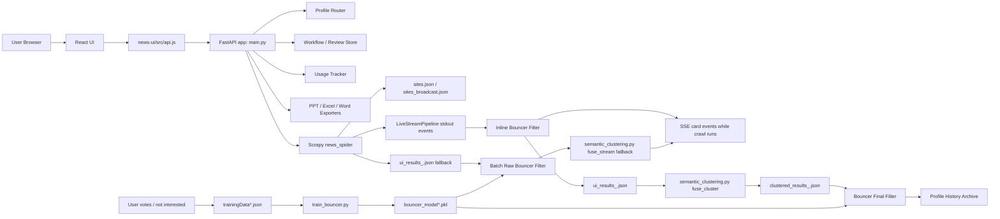

### The Short Version

1. User opens the React app.
2. React calls FastAPI endpoints.
3. FastAPI decides the active profile: `default` or `broadcast`.
4. A manual or scheduled scan runs Scrapy.
5. During manual scans, Scrapy can emit each item immediately through `LiveStreamPipeline`.
6. The backend bounces each live item, streams approved cards to the UI, and keeps a per-job list.
7. Semantic fusion embeds article text and clusters similar stories into final events.
8. Final events are archived.
9. User actions train future filtering.

---

## 3. Backend Entry Point: `main.py`

[main.py](main.py) is the main backend process. When Uvicorn starts it, this file:

1. Imports FastAPI, export libraries, model libraries, thread tools, file tools.
2. Loads bouncer embedder and profile-specific bouncer model files.
3. Defines profile configuration.
4. Defines locks, semaphores, and global job status.
5. Loads the local FLAN-T5 opinion / insight model.
6. Defines helpers for categories, teams, region correction, bouncer scoring, workflow stores, exports, analytics.
7. Starts the background scheduler in the FastAPI lifespan.
8. Registers API endpoints.
9. Serves the React build from `news-ui/dist`.

### `main.py` Section Map

| Section | What It Does | Main Things To Know |
|---|---|---|
| AI Gatekeeper loading | Loads `local_miniLM_model` and `bouncer_model*.pkl` | If a model file is missing, that profile scans without bouncer filtering. |
| Configuration | Defines keywords, paths, profile names, secret keys | Most operational knobs are here. |
| Profile routing/storage | Maps IP or override to `default` / `broadcast` | Broadcast IPs live in `BROADCAST_SPECIAL_IPS`. |
| Team IP map | Maps IPs to known names | Used for analytics ownership, not access control by itself. |
| Analytics allowlist | Controls who sees analytics | `ANALYTICS_ALLOWED_IPS` plus `ANALYTICS_KEY`. |
| Locks / thread state | Prevents collisions | `crawl_semaphore`, `scheduler_lock`, `train_lock`, etc. |
| Local FLAN-T5 | Generates opinion and "why it matters" text | Falls back if weak or unavailable. |
| Category matrix | Tags articles by keyword rules | Simple deterministic category assignment. |
| Region learning | Lets users correct Local / Global | Saved per profile. |
| Bouncer helpers | Scores articles as interested/not interested | Runtime text format matches training text. |
| Workflow helpers | Selected / approved queue storage | Profile-aware JSON files. |
| Scheduler | Runs every 4 hours | Runs both default and broadcast profiles. |
| Manual crawl | SSE streaming endpoint | Runs Scrapy, bouncer, fusion, archive. |
| Exports | PPT, Excel, Word | Uses template/layout libraries. |
| Analytics | Tracks users/devices/actions | Key + IP protected. |
| Static serving | Serves React build | Catch-all routes non-API frontend paths. |

---

## 4. Profiles: Default vs Broadcast

There are two profiles:

| Profile | Meaning | Sources File | Keywords | History Dir | Bouncer Model |
|---|---|---|---|---|---|
| `default` | General tech / AI / Samsung / devices intelligence | `sites.json` | `MORNING_KEYWORDS` | `intelligence_store/default/history` | `bouncer_model.pkl` |
| `broadcast` | Broadcast / DTH / OTT / media intelligence | `sites_broadcast.json` | `BROADCAST_MORNING_KEYWORDS` | `intelligence_store/broadcast/history` | `bouncer_model_broadcast.pkl` |

### Profile Decision Flow

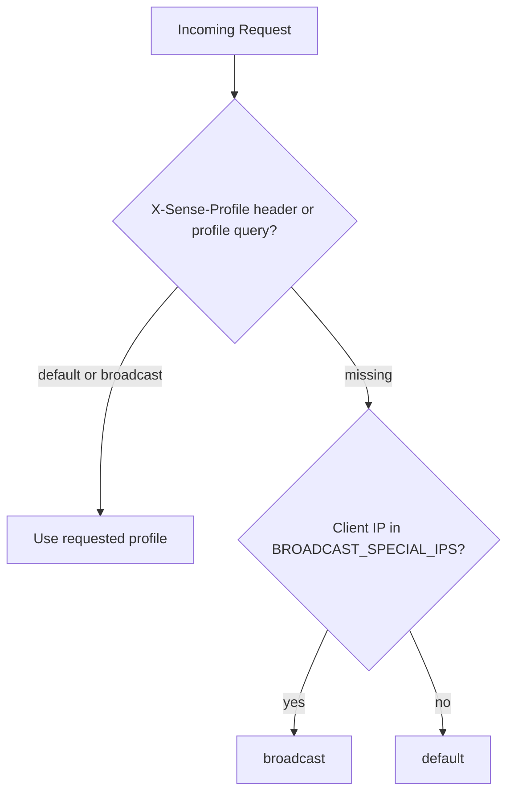

### Important Behavior

The backend currently supports two ways to choose a profile:

1. IP-based routing.
2. UI/dev override via `X-Sense-Profile` header or `profile` query parameter.

For production, the clean operational model is:

- Put broadcast users' IPs into `BROADCAST_SPECIAL_IPS`.
- Everyone else falls into `default`.
- Use the UI profile switch only as a QA/admin testing override.

### Where To Add Broadcast IPs

In [main.py](main.py), edit:

```python
BROADCAST_SPECIAL_IPS = {
    "107.109.202.212",
    "107.109.202.33",
}
```

Add an IP to make it broadcast.

Remove an IP to make it default.

There is no separate "default IP list" because default is the fallback when the IP is not in `BROADCAST_SPECIAL_IPS`.

### Where To Add User Names By IP

In [main.py](main.py), edit:

```python
TEAM_IP_MAP = {
    "107.109.202.151": "Shreya Gupta",
    ...
}
```

This affects analytics display and ownership labels. It does not automatically grant access to analytics unless that IP is also in the analytics allowlist.

---

## 5. Manual Deep Scan Flow

Manual scans are started from the frontend by the `/crawl` endpoint. This endpoint returns Server-Sent Events, so the UI can show live progress and cards as they are prepared.

The current manual flow is intentionally two-stage:

1. **Live discovery stage:** Scrapy emits article items while it is still crawling. The backend runs the bouncer immediately and streams approved cards to the UI.
2. **Optimization stage:** after crawling finishes, the streamed cards are clustered, deduplicated, scored again, archived, and returned as final data.

This matters because the user no longer has to wait for a long crawl to fully finish before seeing any cards.

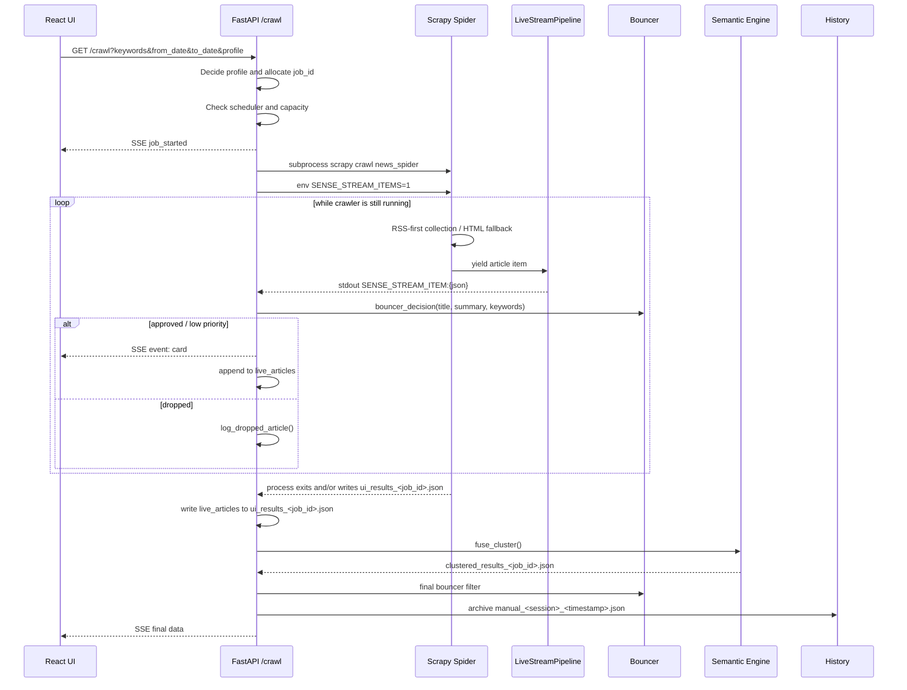

### Manual Scan Details

1. `/crawl` receives `keywords`, `from_date`, `to_date`, `target_sites`, and optional `session_id`.
2. `get_profile_for_request()` decides the profile.
3. A random `job_id` is created with `secrets.token_hex(8)`.
4. Two temporary files are allocated:
   - `ui_results_<job_id>.json`
   - `clustered_results_<job_id>.json`
5. If scheduler is active, the scan is blocked with a clear error.
6. If too many manual scans are running, the scan is rejected with a capacity error.
7. Scrapy is launched as a subprocess.
8. `main.py` sets `SENSE_STREAM_ITEMS=1` so Scrapy's `LiveStreamPipeline` prints each scraped item as a structured stdout line.
9. `/crawl` watches stdout for `SENSE_STREAM_ITEM:` lines.
10. Each live item is deduplicated by link/title.
11. Each live item is immediately checked by `bouncer_decision()`.
12. Dropped live items are logged to `dropped_articles.json`.
13. Kept live items are normalized, category-tagged, region-learned, and streamed as named SSE `card` events.
14. When the crawler finishes, the live approved list is written to `ui_results_<job_id>.json`.
15. `MinimalSemanticEngine.fuse_cluster()` performs duplicate/event clustering.
16. Final bouncer filter runs again on clustered events.
17. Results are archived to the active profile history directory.
18. Temporary files are cleaned after 300 seconds.

### Manual Scan Fallback Path

If no live items are emitted for any reason, `/crawl` falls back to the older batch path:

```text
Scrapy output file -> raw bouncer -> fuse_stream card events -> fuse_cluster -> final bouncer -> archive
```

This keeps Deep Scan usable even if a future spider or pipeline does not emit live item lines.

### Manual History Persistence And Visibility

Manual results are saved, but they are session-scoped:

```text
intelligence_store/<profile>/history/manual_<session_id>_<timestamp>.json
```

The frontend creates `session_id` with `getSessionId()` in `news-ui/src/utils/session.js` and stores it in browser `localStorage` under:

```text
sense-session-id
```

That means:

- Refreshing the same browser does **not** delete manual history.
- The same browser/device can reopen its manual archive later.
- Other users normally do **not** see another user's manual runs in the archive UI because `/history/list` and `/history/range` filter `manual_` files by `session_id`.
- Scheduled `briefing_*.json` files remain shared by profile.

Current limitation: `GET /history/{filename}` resolves a file by filename and profile. The UI does not reveal another user's manual filename, but direct filename access should be hardened in Phase 2 by validating that `manual_` filenames match the current `session_id`.

---

## 6. Scheduled Briefing Flow

The scheduler is created in the FastAPI lifespan using APScheduler.

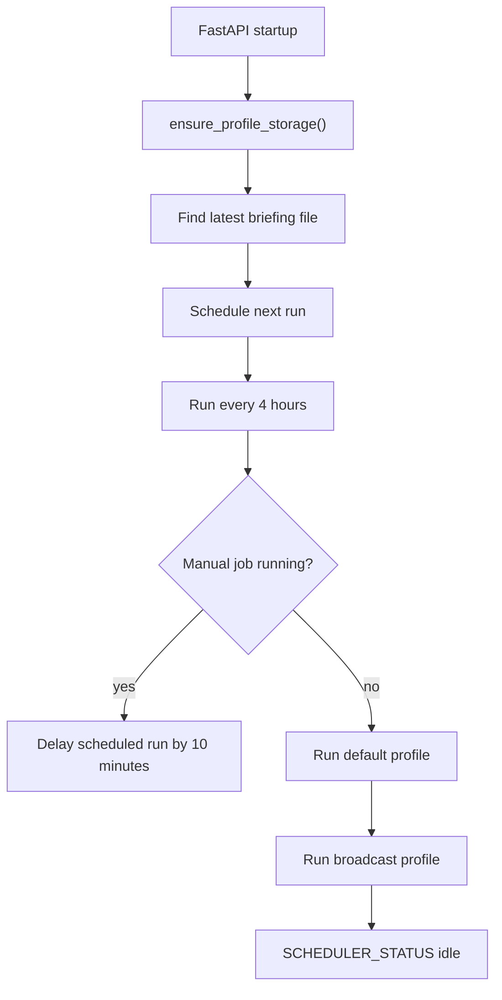

### Scheduler Behavior

`run_morning_briefing()` is the runtime scheduler entry point.

It:

- Uses `scheduler_lock`.
- Skips if already active.
- Defers itself by 10 minutes if manual jobs are queued/running.
- Runs both profiles:
  - `default`
  - `broadcast`
- Updates `SCHEDULER_STATUS`.

Each profile runs through `run_scheduler_for_profile(profile)`.

That function:

1. Builds profile-specific Scrapy command.
2. Uses profile-specific keywords and sites file.
3. Runs Scrapy with a 1-hour timeout.
4. Runs raw bouncer.
5. Runs `semantic_clustering.py --job-id <id> --fast-mode`.
6. Runs final bouncer.
7. Assigns category and learned region.
8. Logs training/search archive.
9. Saves briefing history in the profile directory.
10. Cleans temp files.

---

## 7. Scraper / Spider Flow

The Scrapy spider is [news_aggregator/news_aggregator/spiders/universal_spider.py](news_aggregator/news_aggregator/spiders/universal_spider.py).

It is called with arguments from `main.py`:

```bash
python -m scrapy crawl news_spider \
  -a keyword=... \
  -a from_date=... \
  -a to_date=... \
  -a target_sites=... \
  -a sites_file=... \
  -O ui_results_<job_id>.json
```

### Spider Data Flow

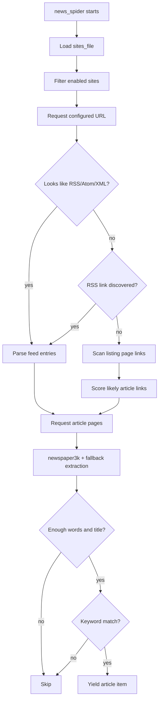

### What The Spider Emits

Each article item includes:

- `source`
- `title`
- `link`
- `date`
- `snippet`
- `summary`
- `full_content`
- `top_image`
- `authors`
- `keywords_found`
- `word_count`
- `method`

### Live Streaming Pipeline

The Scrapy item pipeline is configured in:

- [news_aggregator/news_aggregator/settings.py](news_aggregator/news_aggregator/settings.py)

```python
ITEM_PIPELINES = {
    "news_aggregator.pipelines.LiveStreamPipeline": 100,
    "news_aggregator.pipelines.NewsAggregatorPipeline": 300,
}
```

`LiveStreamPipeline` lives in:

- [news_aggregator/news_aggregator/pipelines.py](news_aggregator/news_aggregator/pipelines.py)

It is only active when the backend launches Scrapy with:

```text
SENSE_STREAM_ITEMS=1
```

When active, it prints one UTF-8 JSON line per scraped item:

```text
SENSE_STREAM_ITEM:{...article json...}
```

`main.py` reads those stdout lines, bounces the item, and emits a browser SSE `card` event. This keeps the spider independent: it still yields normal Scrapy items and still writes the final `-O ui_results_<job_id>.json` file.

### RSS-First Strategy

The spider first tries feeds because they are cleaner and faster. If feeds fail or are not present, it discovers likely article links from page structure.

### HTML Fallback Strategy

For non-feed pages:

- It ignores nav/header/footer/form links.
- It scores paths with `/news/`, `/article/`, `/story/`, date-like paths, and longer titles.
- It avoids account, login, tag, author, video, privacy, subscribe, and other non-story URLs.

### Timezone Parsing

The spider has a `TZINFOS` map for common feed abbreviations such as `PDT`, `PST`, `EDT`, `UTC`, and `GMT`. This prevents dateutil warnings like:

```text
UnknownTimezoneWarning: tzname PDT identified but not understood
```

The dates are still normalized into the same `YYYY-MM-DD` style used by history and latest-day filtering.

---

## 8. Semantic Fusion, Embeddings, Summaries, and Freshness

Semantic fusion is handled by [semantic_clustering.py](semantic_clustering.py).

### What It Loads

| Model / Tool | Location | Purpose |
|---|---|---|
| SentenceTransformer | `semantic_model` or `local_miniLM_model` | Embeddings for duplicate/event clustering |
| AgglomerativeClustering | scikit-learn | Groups similar articles |
| Sentiment pipeline | `distilbert-base-uncased-finetuned-sst-2-english` | Simple positive/negative/neutral label |
| BART summarizer | `local_bart_model` | Optional deeper summary generation |
| seen registry | `seen_registry.json` | Tracks first-seen links |

`MinimalSemanticEngine` now defaults to `load_summarizer=False`. That means the heavy BART model is not loaded during every manual crawl startup. It is loaded lazily only when deeper summarization is explicitly needed. Shared BART state is protected by:

- `SUMMARY_MODEL_LOCK`
- `SUMMARY_INFERENCE_LOCK`

This avoids duplicate model loads and keeps simultaneous scans from colliding inside CPU inference.

### Is This RAG?

Strictly speaking, no. There is no persistent vector database, no chunk-level document store, and no query-time nearest-neighbor retriever.

The current system has RAG-like stages:

1. Retrieval: Scrapy retrieves articles from configured sources.
2. Grounding text: article titles, snippets, summaries, and full content become the source material.
3. Embeddings: MiniLM/SentenceTransformer converts article text into vectors.
4. Semantic grouping: clustering groups articles that likely describe the same event.
5. Generation: BART creates summaries when available, and FLAN-T5 creates "why this matters" style insight.
6. Learning: the bouncer model learns user preference from votes and not-interested actions.

That means the intelligence is grounded in retrieved article text, but the backend does not yet support asking arbitrary questions over a stored vector corpus. If that becomes a requirement later, the natural upgrade would be:

```text
article chunks -> vector DB -> query retriever -> LLM answer with citations
```

### Embedding / Clustering Flow

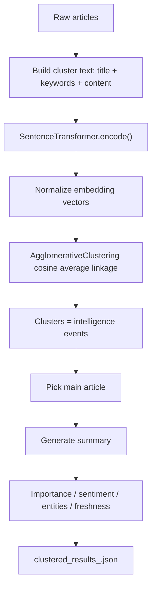

### Important Parameters

In [semantic_clustering.py](semantic_clustering.py):

```python
DEFAULT_CLUSTER_DISTANCE_THRESHOLD = 0.32
MAX_CLUSTER_TEXT_CHARS = 2200
```

Lower distance threshold means stricter clustering. Higher means more stories may be merged together.

### Streaming Mode vs Cluster Mode

There are two semantic phases available during manual scans:

1. `fuse_stream()`
   - Converts each raw article into a lightweight card.
   - Uses lightweight summaries.
   - Streams quickly to the UI.
   - Used as a fallback when live spider item streaming is not available.

2. `fuse_cluster()`
   - Re-embeds all articles.
   - Clusters duplicates/similar stories.
   - Produces final optimized results.

In the current preferred manual flow, the first visible cards are streamed before `fuse_stream()` by `/crawl` itself, using Scrapy's live item lines plus the bouncer. `fuse_cluster()` still runs afterward to produce the final optimized result set.

### Fast Mode

Scheduled runs use `--fast-mode`.

This avoids slow BART summarization and uses lightweight extractive summaries. This is important because scheduled runs can process many sources and must not stall the server.

### Freshness

`seen_registry.json` stores article links and first-seen times.

If a link is already in the registry:

- `is_fresh = false`
- `first_seen = old timestamp`

If it is new:

- `is_fresh = true`
- link is added to the registry.

The file is protected by locks in `semantic_clustering.py` so concurrent runs do not casually overwrite each other.

---

## 9. Bouncer Model and Training Loop

The bouncer is a profile-aware relevance filter. It decides whether an article should be kept, marked low priority, or dropped.

### Runtime Bouncer Flow

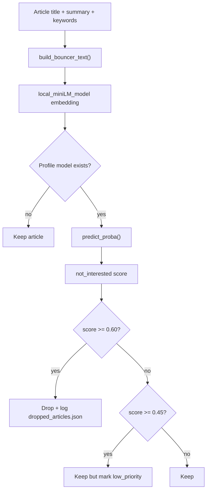

The bouncer is used in three places:

1. **Manual live stage:** each `SENSE_STREAM_ITEM` is bounced before it is allowed to appear in the UI.
2. **Manual/scheduler raw batch stage:** if a batch output file is used, raw items are filtered before semantic fusion.
3. **Final stage:** clustered/fused events are filtered again before archive/final data.

The live-stage decision is attached to the streamed card as:

- `bouncer_decision`
- `bouncer_score`
- `bouncer_reason`
- `bouncer_stage = "manual_live"`

### Thresholds

In [main.py](main.py):

```python
BOUNCER_LOW_PRIORITY_THRESHOLD = 0.45
BOUNCER_HARD_DROP_THRESHOLD = 0.60
```

### Training Data

Training data files:

- `trainingData.json` for default.
- `trainingData_broadcast.json` for broadcast.

Model output files:

- `bouncer_model.pkl`
- `bouncer_model_broadcast.pkl`

### Training Flow

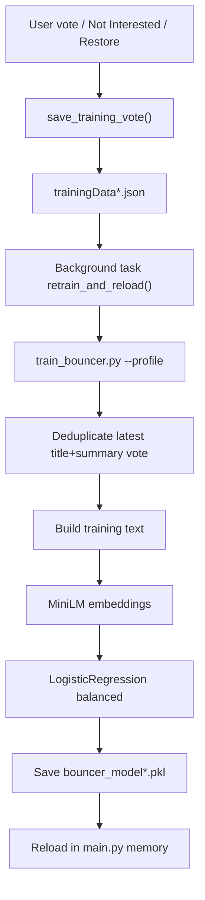

### Labels

Interested labels:

- `interested`
- `like`
- `liked`
- `keep`
- `relevant`
- `up`

Not interested labels:

- `not_interested`
- `not_intrested`
- `dislike`
- `irrelevant`
- `drop`
- `down`

### Why The Runtime Text Must Match Training Text

Both runtime and training use this format:

```text
Title: ...
Keywords: ...
Summary: ...
```

That matters because the model learns from sentence-transformer embeddings of that exact style of text. If training text and runtime text drift too much, bouncer quality drops.

---

## 10. Dossier Insight / Local FLAN-T5

There are two related local FLAN-T5 uses:

1. `generate_opinion(text)`
   - Used in exports.
   - Creates a one-sentence professional opinion.

2. `generate_why_it_matters(item, profile)`
   - Used by `/insight`.
   - Feeds the dossier "Why This Matters" section.

### Insight Flow

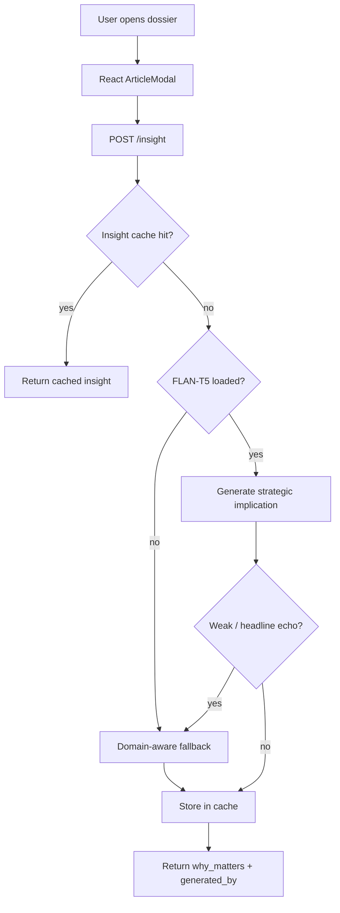

### Why There Is A Fallback

Small local models can sometimes repeat the title or produce weak generic text. The backend detects weak output and replaces it with a deterministic category-aware sentence.

This keeps the dossier reliable even when local model output is mediocre.

---

## 11. Workflow, Not Interested, Region Learning, and History

### Workflow Store

Workflow files:

- `workflow_store.json`
- `workflow_store_broadcast.json`

Structure:

```json
{
  "selected": [],
  "approved": []
}
```

Endpoints:

- `GET /workflow`
- `POST /workflow/select`
- `POST /workflow/approve`
- `POST /workflow/remove`

Approval requires `DIRECTOR_KEY`.

### Not Interested Store

Files:

- `not_interested_store.json`
- `not_interested_store_broadcast.json`

Not interested items expire after:

```python
NOT_INTERESTED_EXPIRY_HOURS = 22
```

When a user marks an article not interested:

1. It goes into the profile-specific not-interested store.
2. A `not_interested` training vote is saved.
3. The profile bouncer retrains in the background.

When restored:

1. It is removed from the not-interested store.
2. An `interested` training vote is saved.
3. The bouncer retrains.

### Region Learning

Files:

- `region_learning.json`
- `region_learning_broadcast.json`

Endpoint:

- `POST /region/correct`

Users can correct Local/Global region. The backend saves keywords and exact-title corrections, then applies learned regions to future and existing results.

### History

Profile-aware history lives in:

- `intelligence_store/default/history`
- `intelligence_store/broadcast/history`

Legacy default history is still read from:

- `history_archive`

History endpoints:

- `GET /latest-briefing`
- `GET /briefing/meta`
- `GET /history/list`
- `GET /history/range`
- `GET /history/{filename}`

### Archive UI Behavior

The React archive screen uses two history concepts:

1. **Range memory search**
   - Calls `GET /history/range?from_date=YYYY-MM-DD&to_date=YYYY-MM-DD&session_id=<browser-session>`.
   - Loads all scheduler briefings in the selected date range.
   - Also loads only manual runs whose filename starts with the current browser session ID.
   - Deduplicates by title.
   - Lets the user filter the loaded archive by text, region, category, source, signal type, image presence, and sort order.

2. **Single run open**
   - Calls `GET /history/{filename}` when the user clicks a run pill in the archive timeline.
   - Loads that one retained JSON file into the same card workspace.

### Manual vs Scheduler History

Scheduler archives are shared within the active profile:

```text
briefing_YYYY-MM-DD_HH-MM-SS.json
```

Manual archives are browser-session scoped:

```text
manual_<session_id>_YYYY-MM-DD_HH-MM-SS.json
```

`/history/list` and `/history/range` intentionally hide manual files unless their prefix matches the requesting `session_id`. This keeps two people from seeing each other's manual search history in normal UI usage.

Phase 2 should harden `GET /history/{filename}` so direct manual filename access also requires a matching `session_id`.

---

## 12. Export Engines

Exports are handled in [main.py](main.py).

### PowerPoint

Endpoint:

- `POST /export-ppt`

Uses:

- `template.pptx`
- `python-pptx`
- local image downloader
- `generate_opinion()`
- `determine_target_team()`

Broadcast profile currently blocks PowerPoint export.

### Excel

Endpoint:

- `POST /export-excel`

Uses:

- `openpyxl`

Exports weekly report format with category, keyword, highlight, and URL.

### Word

Endpoint:

- `POST /export-word`

Uses:

- `python-docx`

Builds a styled intelligence brief with headers, footer, summary bullets, insight, routing, and sources.

---

## 13. Analytics and Usage Tracking

### Tracking

Endpoint:

- `POST /track`

Frontend sends:

- page load
- search
- article click
- votes
- exports
- briefing view
- heartbeat
- VOC feedback

Stored in:

- `usage_tracker.json`

Device ID is generated from:

```text
ip + browser fingerprint
```

### Analytics Access

Endpoints:

- `GET /analytics/access`
- `GET /analytics?key=...`

Analytics is protected by:

1. IP allowlist: `ANALYTICS_ALLOWED_IPS`
2. Key: `ANALYTICS_KEY`

Frontend page:

- `/director-analytics`

The API endpoint remains:

- `/analytics`

This avoids a route conflict between React and FastAPI.

---

## 14. Concurrency and Reliability

Concurrency matters because multiple people can run deep scans while the scheduler may also want to run.

### Main Controls

| Control | Purpose |
|---|---|
| `crawl_semaphore = Semaphore(3)` | Allows at most 3 manual crawl jobs at once. |
| `active_jobs` | Tracks queued/running/complete/error/blocked jobs. |
| `scheduler_lock` | Protects scheduler state and job status mutations. |
| `SCHEDULER_STATUS` | Shows scheduler active/idle state. |
| `train_lock` | Prevents multiple bouncer retrains at once. |
| `file_lock` | Protects training data writes. |
| `not_interested_lock` | Protects not-interested store mutations. |
| `tracker_lock` | Protects usage tracker writes. |
| `region_learning_lock` | Protects region learning writes. |
| `dropped_lock` | Protects dropped article logging. |
| `opinion_lock` | Serializes FLAN-T5 inference. |
| `insight_cache_lock` | Protects the insight cache. |
| `SUMMARY_MODEL_LOCK` | Loads shared BART only once. |
| `SUMMARY_INFERENCE_LOCK` | Serializes BART generation. |
| `SEEN_REGISTRY_LOCK` | Protects freshness registry reads/writes. |

### Manual vs Scheduler Rules

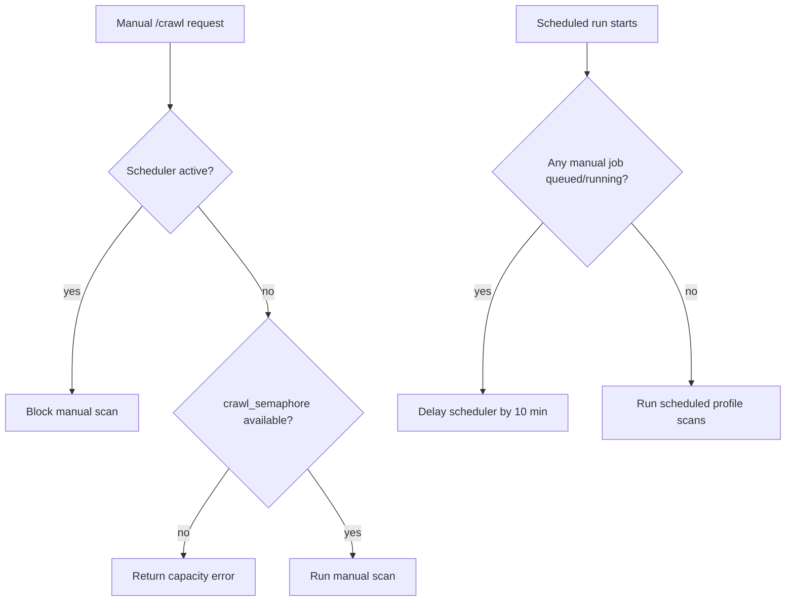

### Why This Does Not Break Under Multiple Users

- Each manual scan gets its own `job_id`.
- Each scan writes to unique temp files.
- Live streamed cards are kept in per-request memory (`live_articles`) and then written to that job's own `ui_results_<job_id>.json`.
- Scrapy live item emission is opt-in per subprocess via `SENSE_STREAM_ITEMS=1`, so scheduled/background Scrapy behavior is not accidentally changed.
- Only 3 scans run at once.
- Scheduler does not start if manual scans are active.
- Manual scans do not start if scheduler is active.
- Shared model inference is locked where needed.
- Shared JSON stores use locks for critical writes.
- Manual archive visibility is scoped by browser `session_id` in list/range endpoints.

---

## 15. Storage Map

| File / Directory | Purpose |
|---|---|
| `sites.json` | Default profile source list. |
| `sites_broadcast.json` | Broadcast profile source list. |
| `trainingData.json` | Default bouncer training data. |
| `trainingData_broadcast.json` | Broadcast bouncer training data. |
| `bouncer_model.pkl` | Default trained bouncer. |
| `bouncer_model_broadcast.pkl` | Broadcast trained bouncer. |
| `local_miniLM_model` | Local sentence embedding model. |
| `semantic_model` | Preferred semantic clustering model if present. |
| `local_bart_model` | Local summarization model. |
| `flan-t5-local` | Local opinion/why-it-matters model. |
| `seen_registry.json` | Link freshness registry. |
| `workflow_store.json` | Default selected/approved workflow. |
| `workflow_store_broadcast.json` | Broadcast selected/approved workflow. |
| `not_interested_store.json` | Default hidden/rejected articles. |
| `not_interested_store_broadcast.json` | Broadcast hidden/rejected articles. |
| `region_learning.json` | Default region correction memory. |
| `region_learning_broadcast.json` | Broadcast region correction memory. |
| `usage_tracker.json` | Usage analytics. |
| `voc_feedback.json` | Voice of customer feedback. |
| `dropped_articles.json` | Bouncer-dropped articles sample log. |
| `training_dataset.csv` | Search archive written by `learner.py`. |
| `history_archive` | Legacy default history. |
| `intelligence_store/default/history` | Default profile history. |
| `intelligence_store/broadcast/history` | Broadcast profile history. |
| `briefing_YYYY-MM-DD_HH-MM-SS.json` | Shared scheduler archive file inside a profile history directory. |
| `manual_<session_id>_YYYY-MM-DD_HH-MM-SS.json` | Manual Deep Scan archive file scoped to one browser session. |
| `ui_results_<job_id>.json` | Temporary raw scrape output. |
| `clustered_results_<job_id>.json` | Temporary semantic fusion output. |

---

## 16. Endpoint Map

### Profile and Status

| Endpoint | Purpose |
|---|---|
| `GET /profile` | Shows current profile, paths, bouncer model status, training file status. |
| `GET /status` | Scheduler/manual capacity/profile debug status. |

### Crawl and Briefing

| Endpoint | Purpose |
|---|---|
| `GET /crawl` | Manual deep scan with SSE streaming. |
| `GET /latest-briefing` | Latest archived briefing for active profile. |
| `GET /briefing/meta` | Latest briefing metadata. |
| `POST /briefing/remove` | Remove article from latest briefing. |
| `POST /briefing/restore` | Restore article to latest briefing. |

### Workflow

| Endpoint | Purpose |
|---|---|
| `GET /workflow` | Load selected/approved queues. |
| `POST /workflow/select` | Add item to review queue. |
| `POST /workflow/approve` | Approve selected item using director key. |
| `POST /workflow/remove` | Remove selected/approved item. |

### Training / Feedback

| Endpoint | Purpose |
|---|---|
| `POST /train` | Save vote and retrain bouncer. |
| `POST /not-interested` | Hide item and train as not interested. |
| `GET /not-interested` | List hidden items. |
| `POST /not-interested/restore` | Restore hidden item and train as interested. |
| `POST /region/correct` | Teach region classification. |
| `POST /voc` | Save voice-of-customer feedback. |

### Intelligence Enrichment

| Endpoint | Purpose |
|---|---|
| `POST /insight` | Generate or return cached "why this matters". |

### Source Control

| Endpoint | Purpose |
|---|---|
| `GET /sites` | List profile sources. |
| `POST /sites` | Add source to profile sources file. |

### History

| Endpoint | Purpose |
|---|---|
| `GET /history/list?session_id=...` | List profile history files; scheduler files plus only matching manual session files. |
| `GET /history/range?from_date=...&to_date=...&session_id=...` | Merge scheduler history and matching manual session history between dates. |
| `GET /history/{filename}` | Load one history file. Phase 2 should add manual filename/session validation. |

### Exports

| Endpoint | Purpose |
|---|---|
| `POST /export-ppt` | PowerPoint export. |
| `POST /export-excel` | Excel export. |
| `POST /export-word` | Word export. |

### Analytics

| Endpoint | Purpose |
|---|---|
| `POST /track` | Record usage event. |
| `GET /analytics/access` | Whether current IP may see analytics UI. |
| `GET /analytics?key=...` | Return analytics data if IP and key are valid. |

---

## 17. Hosting / Deployment Notes

### Development Mode

Development usually runs:

```bash
venv/bin/uvicorn main:app --host 127.0.0.1 --port 8000
cd news-ui
npm run dev
```

Vite dev server runs on:

```text
http://127.0.0.1:5173
```

The dev proxy in [news-ui/vite.config.js](news-ui/vite.config.js) points API requests to:

```js
const BACKEND = 'http://127.0.0.1:8000';
```

This is only for Vite dev mode.

### Production / Hosted Mode

The React app uses this in [news-ui/src/api.js](news-ui/src/api.js):

```js
const BASE = import.meta.env.VITE_API_BASE || '';
```

That means:

- If React is served by the same FastAPI backend, keep `VITE_API_BASE` empty.
- API calls go to relative paths like `/status`, `/crawl`, `/latest-briefing`.
- FastAPI serves `news-ui/dist` and handles the API.

If React and FastAPI are hosted separately, set:

```bash
VITE_API_BASE=https://your-backend-host
```

Then rebuild:

```bash
cd news-ui
npm run build
```

### Where `127.0.0.1` Must Be Changed Or Removed

| File | Setting | When To Change |
|---|---|---|
| `news-ui/vite.config.js` | `const BACKEND = 'http://127.0.0.1:8000'` | Dev only. Change if local backend runs elsewhere. Not used by production build. |
| `news-ui/src/api.js` | `VITE_API_BASE || ''` | Set `VITE_API_BASE` only if frontend and backend are on different hosts. |
| Uvicorn command | `--host 127.0.0.1` | For LAN/team access, run `--host 0.0.0.0` behind proper firewall/auth. |
| `ANALYTICS_ALLOWED_IPS` default | includes `127.0.0.1,::1` | Keep for local dev; remove or override via env in production. |

### FastAPI Static Serving

`main.py` serves:

- `/assets` from `news-ui/dist/assets`
- `/` as `index.html`
- frontend catch-all routes as `index.html`

API routes are excluded by `API_ROUTES`, so `/analytics` stays an API route and `/director-analytics` is the React analytics page.

---

## 18. Hard-Coded Knobs and Where To Change Them

### Profile IP Routing

File:

- [main.py](main.py)

Broadcast IPs:

```python
BROADCAST_SPECIAL_IPS = {
    "107.109.202.212",
    "107.109.202.33",
}
```

Add IP here to route to broadcast.

Remove IP to route to default.

### Team Names / Owner Map

File:

- [main.py](main.py)

```python
TEAM_IP_MAP = {
    "107.109.201.245": "Vineet Singh",
}
```

Used by analytics and user ownership labels.

### Analytics Access

File:

- [main.py](main.py)

Defaults:

```python
ANALYTICS_KEY = os.environ.get("ANALYTICS_KEY", DIRECTOR_KEY)
ANALYTICS_ALLOWED_IPS = {
    ip.strip()
    for ip in os.environ.get(
        "ANALYTICS_ALLOWED_IPS",
        "127.0.0.1,::1,107.109.201.245",
    ).split(",")
    if ip.strip()
}
```

Recommended production setup:

```bash
export DIRECTOR_KEY="long-approval-key"
export ANALYTICS_KEY="different-long-analytics-key"
export ANALYTICS_ALLOWED_IPS="107.109.201.245,another.ip.here"
```

### Approval Key

File:

- [main.py](main.py)

```python
DIRECTOR_KEY = os.environ.get("DIRECTOR_KEY", "1357")
```

Used for:

- Workflow approval.
- Default analytics key fallback.

Production should not use `1357`.

### Keywords

File:

- [main.py](main.py)

Default:

```python
MORNING_KEYWORDS = (...)
```

Broadcast:

```python
BROADCAST_MORNING_KEYWORDS = (...)
```

### Sources

Files:

- `sites.json`
- `sites_broadcast.json`

Fields commonly used:

- `name`
- `url`
- `category`
- `enabled`
- `allow_deep_scan`

For scheduler runs, keep broken/blocked feeds disabled.

### Bouncer Thresholds

File:

- [main.py](main.py)

```python
BOUNCER_LOW_PRIORITY_THRESHOLD = 0.45
BOUNCER_HARD_DROP_THRESHOLD = 0.60
```

Raise hard-drop threshold for safer filtering.

Lower it for more aggressive filtering.

### Manual Scan Capacity

File:

- [main.py](main.py)

```python
crawl_semaphore = Semaphore(3)
```

Increase only if CPU, memory, network, and model inference can handle it.

### Scheduler Frequency

File:

- [main.py](main.py)

```python
scheduler.add_job(run_morning_briefing, "interval", hours=4, next_run_time=next_run)
```

Change `hours=4` for another interval.

### Not Interested Expiry

File:

- [main.py](main.py)

```python
NOT_INTERESTED_EXPIRY_HOURS = 22
```

### Semantic Clustering Strictness

File:

- [semantic_clustering.py](semantic_clustering.py)

```python
DEFAULT_CLUSTER_DISTANCE_THRESHOLD = 0.32
```

Lower = stricter clustering.

Higher = more merging.

### Local Models

Folders:

- `local_miniLM_model`
- `semantic_model`
- `local_bart_model`
- `flan-t5-local`

Do not delete these unless you are intentionally changing the model stack.

---

## 19. Common Operations

### Add A Broadcast User

1. Get the user's IP address.
2. Add it to `BROADCAST_SPECIAL_IPS` in `main.py`.
3. Optionally add their name to `TEAM_IP_MAP`.
4. Restart backend.

### Move A Broadcast User Back To Default

1. Remove their IP from `BROADCAST_SPECIAL_IPS`.
2. Restart backend.

### Add Analytics Viewer

1. Add IP to `ANALYTICS_ALLOWED_IPS`.
2. Add name to `TEAM_IP_MAP`.
3. Set `ANALYTICS_KEY`.
4. Restart backend.

### Change Approval Password

Use environment variable:

```bash
export DIRECTOR_KEY="new-long-key"
```

Restart backend.

### Change Analytics Password

Use environment variable:

```bash
export ANALYTICS_KEY="new-long-analytics-key"
```

Restart backend.

### Train Default Bouncer Manually

```bash
python train_bouncer.py --profile default
```

### Train Broadcast Bouncer Manually

```bash
python train_bouncer.py --profile broadcast
```

### Run Backend Locally

```bash
PYTHONPYCACHEPREFIX=/private/tmp/news-scrapper-pycache \
venv/bin/uvicorn main:app --host 127.0.0.1 --port 8000
```

### Run Frontend Locally

```bash
cd news-ui
npm run dev
```

### Build Frontend For FastAPI Serving

```bash
cd news-ui
npm run build
```

Then FastAPI serves:

```text
news-ui/dist/index.html
news-ui/dist/assets/*
```

---

## 20. Known Risks and Future Improvements

### Current Risks

1. JSON files are simple and practical, but a database would be safer for multi-user production.
2. `DIRECTOR_KEY` default is weak if not overridden.
3. Local model inference can be slow on CPU.
4. Some source sites block crawlers or return thin pages.
5. Bouncer quality depends heavily on balanced, consistent feedback.
6. Scheduler and manual scans are coordinated, but all crawling still happens inside the same app host.
7. Analytics is IP + key protected, but IP allowlists are only as reliable as the network/proxy headers.
8. Manual archive list/range endpoints are session-scoped, but direct `GET /history/{filename}` should still be hardened for manual files.
9. Light mode is intentionally disabled for now because the first pass was not visually consistent enough.
10. Language translation is still a Settings preview, not a working locale system.

### Best Future Upgrades

1. Move JSON stores to SQLite or Postgres.
2. Move crawl jobs to a queue worker such as Celery/RQ.
3. Add authenticated user accounts instead of pure IP/key gating.
4. Add an admin screen for editing profile IPs and source lists.
5. Add bouncer model versioning and evaluation dashboards.
6. Add separate deployment profiles for dev/staging/prod.
7. Add health checks for each source feed.
8. Add model warmup and memory monitoring.

### Phase 2 Commitments

The next planned phase should group three related product-hardening items:

1. **Manual archive access hardening**
   - Add `session_id` validation to `GET /history/{filename}` for files beginning with `manual_`.
   - Keep scheduler `briefing_*.json` files shared by profile.
   - Consider deleting or expiring old manual runs if storage grows.

2. **Light mode v2**
   - Do not revive the rejected quick white theme.
   - Build a deliberate, consistent light intelligence-desk palette across homepage, scan, archive, workflow, dossier modal, inputs, cards, and empty states.
   - Keep dark mode as default.

3. **English/Korean interface translation**
   - Turn the Settings preview into a real language toggle.
   - Use a React string catalog first.
   - Keep language independent from `default` / `broadcast` profile.
   - Preserve original article titles, source text, and archive evidence unless optional translation is explicitly requested.

---

## 21. Korean Language Interface Roadmap

### Current State

The Settings menu exposes a designed preview item labelled `English -> 한국어` with a `Beta soon` tag. It is deliberately not a functioning switch yet. Nothing in the API payloads, scraped news content, bouncer training records, stored archives, or export files is translated by that preview control.

That boundary is important: translated navigation is a user-interface concern, while retrieved headlines and summaries are intelligence evidence and should not be silently altered.

The theme system is similarly conservative right now: dark mode is forced as the active production theme. The rejected light-mode experiment remains disabled and should not be treated as a production implementation.

### High-Level Delivery Phases

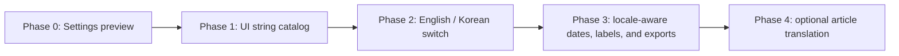

| Phase | Outcome | Main Boundary |
|---|---|---|
| Phase 0 | Visible beta teaser in Settings | No translation behavior or stored-state change. |
| Phase 1 | Centralize fixed React labels into English and Korean dictionaries | Replace hard-coded UI copy only; backend contract stays stable. |
| Phase 2 | Enable a persisted language toggle | Store user locale in browser preference or authenticated user settings; profile routing remains separate. |
| Phase 3 | Localize dates, validation messages, dossier labels, and generated export chrome | Preserve original article title, source, URL, and archive fields. |
| Phase 4 | Offer optional machine translation of article summaries or dossier insight | Retain original text alongside translated text and clearly label translated content. |

### Recommended Architecture

Keep language independent from intelligence profile:

- `default` and `broadcast` decide sources, keywords, history, and bouncer model.
- `en` and `ko` decide interface labels and presentation formatting.
- A Korean user can use either intelligence profile without changing retrieval behavior.

The practical implementation starts in the React application with a small localization provider and string catalogs. Backend localization should be added later only for generated presentation text or optional translated summaries, never by overwriting source-grounded article content.

### What Will Eventually Change

| Area | Proposed Change |
|---|---|
| Settings menu | Activate the preview row as an English / Korean toggle. |
| React screens and modal | Replace visible fixed copy with locale keys. |
| Browser storage | Persist the selected locale independently of `news-profile`. |
| FastAPI responses | Continue returning canonical stored content; add translated fields only where explicitly requested. |
| Models | Bouncer and semantic clustering should continue using canonical/original content unless a separate multilingual evaluation proves a change beneficial. |
| Exports | Add locale selection to UI-generated section labels while retaining original source titles and links. |

---

## Mental Model To Remember

The backend is not one monolithic "scraper." It is an intelligence pipeline:

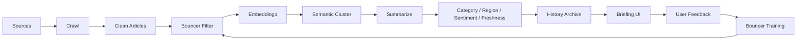

That loop is the product.
